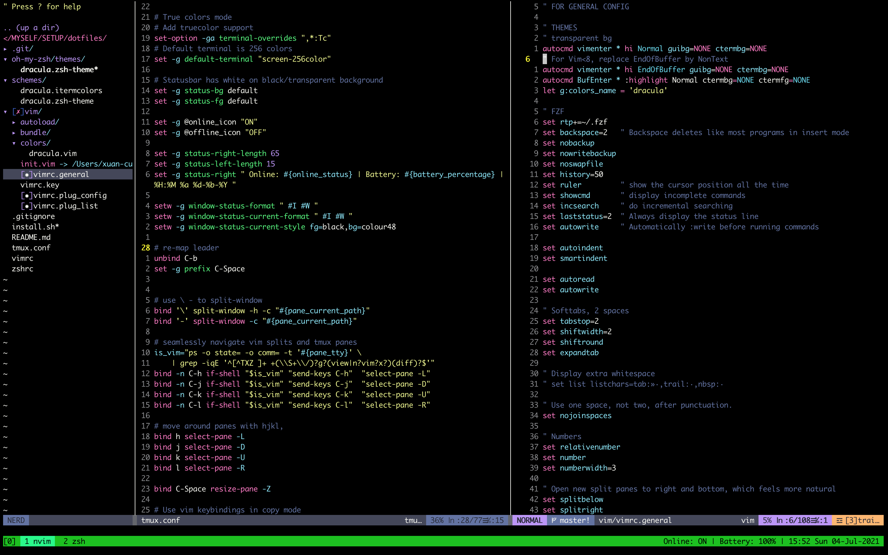

# dotfiles
A set of `vim/neovim`, `zsh`, `tmux`,`fzf`,..etc.. configuration files for Python and JS/TS Developer on LinuxOS.

Install
-------

Clone this project via:

    git clone git@github.com:lexuancuong/dotfiles.git

Simply run file (maybe you  must run `chmod +x ./install.sh` before run that file):

    ./install.sh --macos
    
In `vim/neovim` run:

    :PlugClean

And follow its steps.

After, in `vim/neovim` run:

    :PlugInstall

If you want to get newest version of `vim/neovim` plugin, in `vim/neovim` simply run:

    :PlugUpdate

You can customize your editor style in `./vimrc` file.

If you have some problem with YCM after run the script, you can restart YCM server by this command:

    :YCMRestartServer

Please raise some issues if you have a better plugin or approach for me.

Install and chilllll!!!!

Credit

-------

Thanks to:

https://github.com/phamquiluan

